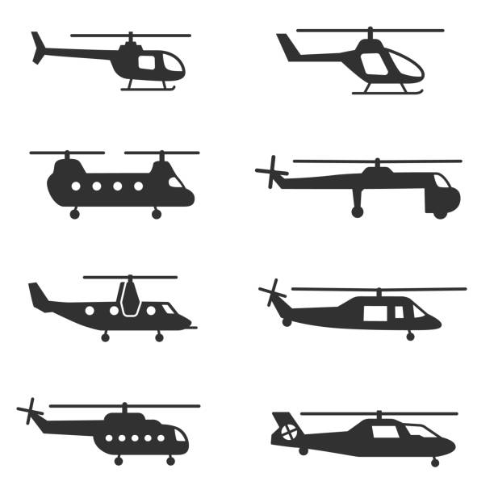

# Mask R-CNN for Object Detection and Segmentation

In this project we will present results and source code to detect helicopters using RCNN and the pretrained COCO dataset. The implementation of this project allows us to achieve our main goal which is detecting any kind of helicopter.



## Installation
From the [Releases page](https://github.com/matterport/Mask_RCNN/releases) page:
1. Download `mask_rcnn_balloon.h5`. Save it in the root directory of the repo (the `mask_rcnn` directory).
2. Download `balloon_dataset.zip`. Expand it such that it's in the path `mask_rcnn/datasets/balloon/`.

## Apply color splash using the provided weights
Apply splash effect on an image:

```bash
python3 balloon.py splash --weights=/path/to/mask_rcnn/mask_rcnn_balloon.h5 --image=<file name or URL>
```

Apply splash effect on a video. Requires OpenCV 3.2+:

```bash
python3 balloon.py splash --weights=/path/to/mask_rcnn/mask_rcnn_balloon.h5 --video=<file name or URL>
```


## Run Jupyter notebooks
Open the `inspect_balloon_data.ipynb` or `inspect_balloon_model.ipynb` Jupter notebooks. You can use these notebooks to explore the dataset and run through the detection pipelie step by step.

## Train the Balloon model

Train a new model starting from pre-trained COCO weights
```
python3 balloon.py train --dataset=/path/to/balloon/dataset --weights=coco
```

Resume training a model that you had trained earlier
```
python3 balloon.py train --dataset=/path/to/balloon/dataset --weights=last
```

Train a new model starting from ImageNet weights
```
python3 balloon.py train --dataset=/path/to/balloon/dataset --weights=imagenet
```

The code in `balloon.py` is set to train for 3K steps (30 epochs of 100 steps each), and using a batch size of 2. 
Update the schedule to fit your needs.
